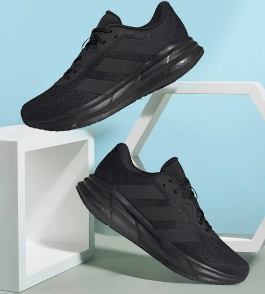

# Product_card
## Date: 09/07/2025
## Objective:

To replicate a product card layout similar to those found on real-time e-commerce platform like FlipKart using the CSS Box Model (margin, border, padding, and content).

## Tasks:

#### 1. Structure the HTML Layout:
Create a container ```<div>``` for the product card.

Add an `````` for the product image.

Include ```<h2>``` for product name, ```<p>``` for description, and a ```<span>``` or ```<div>``` for price.

Add a “Buy Now” or “Add to Cart” button.

#### 2. Apply Box Model Styling in CSS:
Use padding inside each section (image, text, button) to ensure readability.

Use margin around the card to space it from the page edges or other cards.

Add a border to outline the card.

Control width and height for consistent sizing.

#### 3. Visual Styling:
Add a background color to the card container.

Use box-shadow to simulate depth (card lifting effect).

Add border-radius for rounded corners.

#### 4. Center the Card:
Use display: flex and justify-content: center and align-items: center on the parent container.

#### 5. Bonus Enhancements:
Use a hover effect on the button (e.g., background color change).

Make the card responsive with percentage-based widths or media queries.
## HTML Code:
```html
<!DOCTYPE html>
<html lang="en">
  <head>
    <meta charset="UTF-8" />
    <meta name="viewport" content="width=device-width, initial-scale=1" />
    <title>Flipkart Clone</title>
    <link rel="stylesheet" href="styles.css" />
  </head>
  <body>
    <header>
      <div class="logo">Flipkart</div>
      <div class="search-bar">
        <input type="text" placeholder="Search for products, brands and more" />
        <button>Search</button>
      </div>
      <nav>
        <a href="#">Login</a>
        <a href="#">More</a>
        <a href="#">Cart</a>
      </nav>
    </header>

    <section>
      <div class="product-grid">
        <div class="product-card">
          
          <div class="product-title">Sparx Men's Red Sports Shoes</div>
          <div class="product-price">₹1,299</div>
        </div>
        <div class="product-card">
          
          <div class="product-title">Adidas Running Shoes</div>
          <div class="product-price">₹3,999</div>
        </div>
        <div class="product-card">
          
          <div class="product-title">Lenovo Tab M8 Tablet</div>
          <div class="product-price">₹10,499</div>
        </div>
        <div class="product-card">
          
          <div class="product-title">Men's Formal Shirt</div>
          <div class="product-price">₹799</div>
        </div>
      </div>
    </section>
  </body>
</html>

```
## CSS Code:
```css
* {
    box-sizing: border-box;
    margin: 0;
    padding: 0;
    font-family: Arial, sans-serif;
  }
  
  body {
    background-color: #f1f3f6;
  }
  
  
  header {
    background-color: #2874f0;
    color: white;
    padding: 10px 20px;
    display: flex;
    align-items: center;
    justify-content: space-between;
  }
  
  .logo {
    font-size: 28px;
    font-weight: bold;
    cursor: pointer;
  }
  
  .search-bar {
    flex: 1;
    margin: 0 20px;
    display: flex;
  }
  
  .search-bar input {
    width: 100%;
    padding: 8px 12px;
    border: none;
    border-radius: 2px 0 0 2px;
    font-size: 16px;
  }
  
  .search-bar button {
    background-color: #ffe500;
    border: none;
    padding: 8px 15px;
    border-radius: 0 2px 2px 0;
    cursor: pointer;
    font-weight: bold;
  }
  
  nav {
    display: flex;
    gap: 15px;
  }
  
  nav a {
    color: white;
    text-decoration: none;
    font-weight: 600;
    font-size: 14px;
    cursor: pointer;
  }
  
  nav a:hover {
    text-decoration: underline;
  }
  

  main {
    padding: 20px;
  }
  
  .product-grid {
    display: grid;
    grid-template-columns: repeat(auto-fill, minmax(180px, 1fr));
    gap: 15px;
  }
  
  .product-card {
    background: white;
    border-radius: 4px;
    padding: 10px;
    box-shadow: 0 0 6px rgba(0,0,0,0.1);
    display: flex;
    flex-direction: column;
    cursor: pointer;
    transition: box-shadow 0.2s ease;
  }
  
  .product-card:hover {
    box-shadow: 0 0 15px rgba(40,116,240,0.4);
  }
  
  .product-image {
    height: 160px;
    object-fit: contain;
    margin-bottom: 10px;
  }
  
  .product-title {
    font-size: 14px;
    font-weight: 600;
    margin-bottom: 6px;
    color: #212121;
    min-height: 40px;
  }
  
  .product-price {
    color: #388e3c;
    font-weight: bold;
    font-size: 16px;
  }
  
```
## Output:

## Result:
A product card layout similar to those found on real-time e-commerce platform like FlipKart using the CSS Box Model is replicated successfully.
